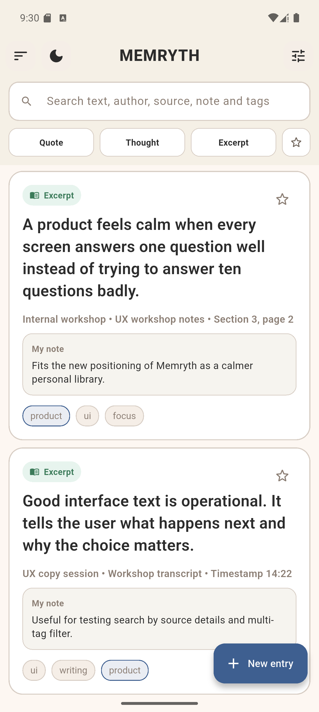
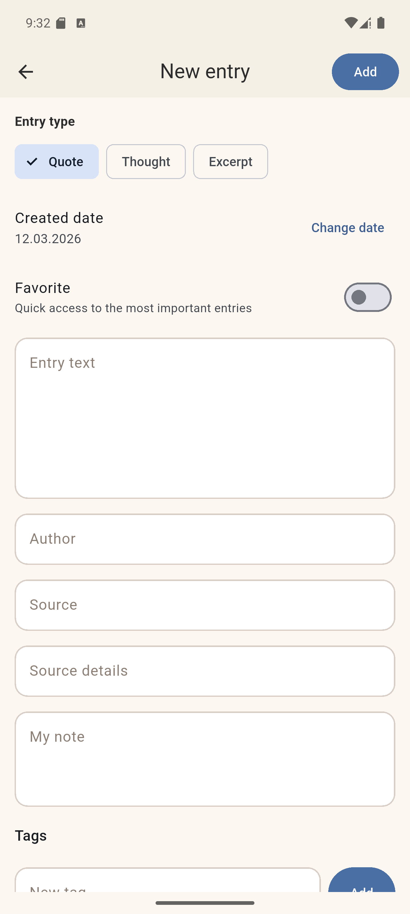
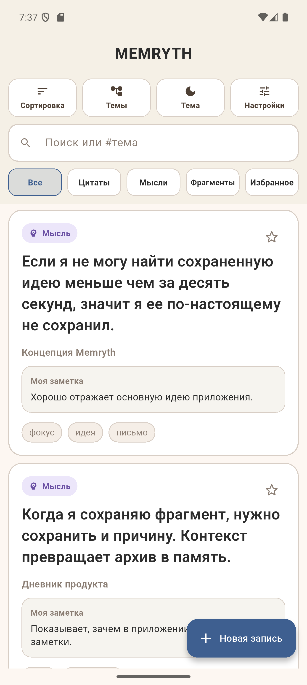
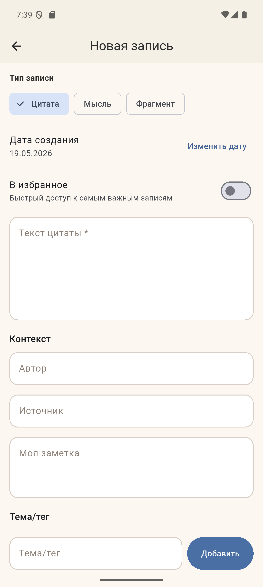
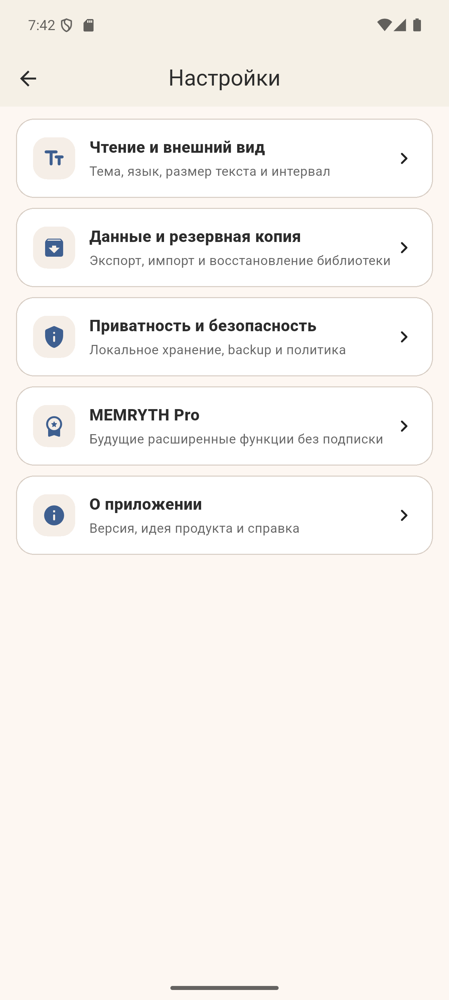
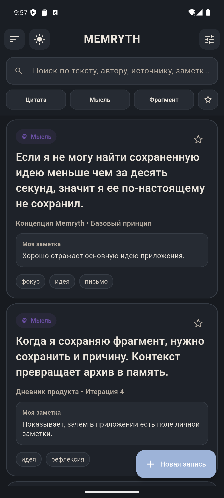

# MEMRYTH

MEMRYTH is an Android-first Flutter app for collecting meaningful text fragments in one place. It supports quotes, personal thoughts, and excerpts, each with source metadata, tags, favorites, notes, and reading-focused display settings.

## Highlights

- Three entry types: `Quote`, `Thought`, `Excerpt`
- Full-text search across text, author, source, note, and tags
- Filters by entry type, favorites, and selected tags
- Sorting by newest, updated, oldest, or random order
- Detailed entry screen with metadata and editable created date
- Local offline storage with Hive
- Bilingual interface: English and Russian
- Reading controls: theme, text size, line spacing, tag size, preview density, default sort
- Android-only project setup

## Current Product Logic

MEMRYTH is no longer just a quote list. The current version is a personal text memory space:

- `Quote` for finished citations from external sources
- `Thought` for your own ideas, conclusions, and observations
- `Excerpt` for larger fragments from books, articles, lectures, or videos

Each entry may contain:

- main text
- author or speaker
- source title
- source details such as chapter, page, or timestamp
- private note
- tags
- favorite state
- created and updated dates

## Tech Stack

- Flutter
- Dart
- Hive / hive_flutter
- Material 3

## Project Structure

```text
lib/
  main.dart
  data/
  models/
  repositories/
  contollers/
  viewmodels/
  screens/
  widgets/
  settings/
```

Detailed Russian documentation about architecture and responsibilities is available in [docs/app_logic_ru.md](docs/app_logic_ru.md).

## Screenshots

### English

<p align="center">
  
  
</p>

### Russian

<p align="center">
  
  
</p>

### Settings

<p align="center">
  
  
</p>

## Getting Started

```bash
flutter pub get
flutter run
```

## Useful Commands

```bash
flutter analyze
flutter test
dart format lib test
flutter build apk --release
```

## Russian Summary

MEMRYTH — это Flutter-приложение для Android, в котором можно хранить цитаты, мысли и фрагменты текста. У каждой записи есть теги, источник, заметка, избранное, дата создания и настройки отображения. Интерфейс поддерживает английский и русский языки.
