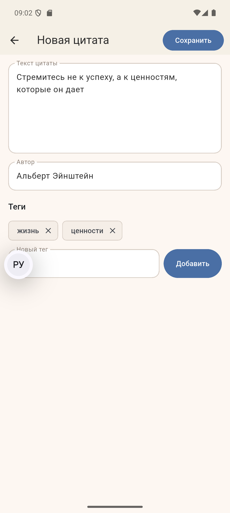
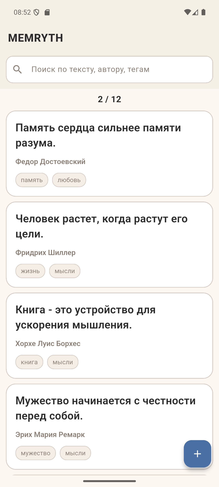

# MEMRYTH (Flutter)

MEMRYTH is a Flutter app for storing and organizing quotes.
You can add, edit, delete, search, filter by tags, and copy quotes in a share-friendly format.

## Features

- Add and edit quotes
- Delete quotes with confirmation dialog
- Search by quote text/author
- Tag-based filtering
- Expand/collapse long quote text
- Long-press menu on quote card:
  - Edit
  - Copy (`quote text` + new line + `- author`)
  - Delete
- Confirmation dialog when leaving edit screen with unsaved changes
- Local offline storage with Hive

## Tech Stack

- Flutter
- Dart
- Hive / hive_flutter
- Material 3

## Project Structure

```text
lib/
  main.dart
  models/
  repositories/
  screens/
  widgets/
```

## Getting Started

### 1. Prerequisites

- Flutter SDK installed
- Dart SDK (comes with Flutter)
- Android Studio / VS Code (optional, but recommended)

### 2. Install dependencies

```bash
flutter pub get
```

### 3. Run the app

```bash
flutter run
```

## Build

### Android APK

```bash
flutter build apk --release
```

### Windows (if enabled)

```bash
flutter build windows --release
```

## Useful Commands

```bash
flutter analyze
flutter test
dart format lib test
```

## Screenshot

Main UI screenshot:

- `flutter_01.png`

## Notes

- This repository is an app project, so `pubspec.lock` is intentionally versioned.
- Local IDE and generated build artifacts are excluded via `.gitignore`.

---

# MEMRYTH (Flutter) - Русская версия

MEMRYTH - это Flutter-приложение для хранения и удобной организации цитат.
Можно добавлять, редактировать, удалять, искать, фильтровать по тегам и копировать цитаты в удобном формате.

## Возможности

- Добавление и редактирование цитат
- Удаление с подтверждением
- Поиск по тексту цитаты и автору
- Фильтрация по тегам
- Сворачивание/разворачивание длинного текста цитаты
- Меню по долгому нажатию на карточку цитаты:
  - Редактировать
  - Копировать (`текст цитаты` + новая строка + `- автор`)
  - Удалить
- Подтверждение при выходе с экрана редактирования при несохраненных изменениях
- Локальное офлайн-хранилище на Hive

## Технологии

- Flutter
- Dart
- Hive / hive_flutter
- Material 3

## Структура проекта

```text
lib/
  main.dart
  models/
  repositories/
  screens/
  widgets/
```

## Быстрый старт

### 1. Что нужно установить

- Flutter SDK
- Dart SDK (идет вместе с Flutter)
- Android Studio / VS Code (опционально, но рекомендуется)

### 2. Установка зависимостей

```bash
flutter pub get
```

### 3. Запуск приложения

```bash
flutter run
```

## Сборка

### Android APK

```bash
flutter build apk --release
```

### Windows (если поддержка включена)

```bash
flutter build windows --release
```

## Полезные команды

```bash
flutter analyze
flutter test
dart format lib test
```

  ## Screenshots                                                    
                                                                    
  <p align="center">                                                
                                                        
                                                        
  </p> 